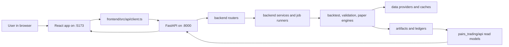
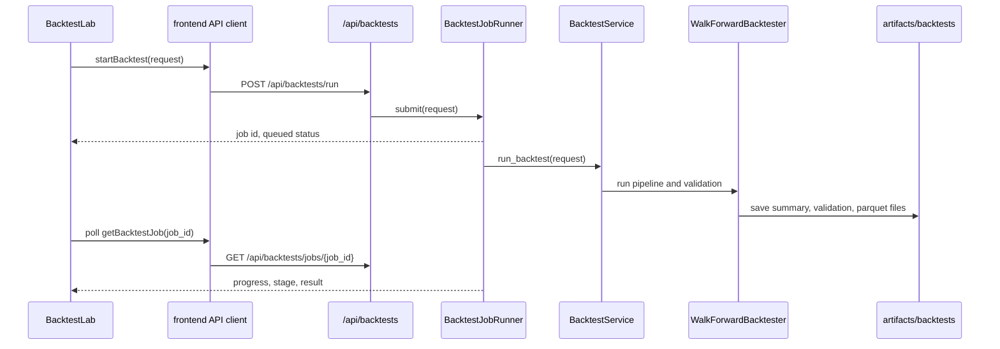
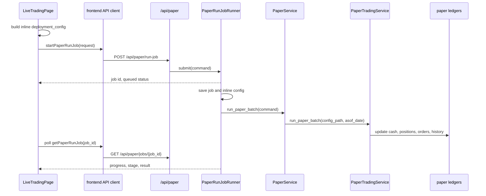

# Backend And Frontend Tutorial

This guide explains how the whole application fits together: the React frontend, the FastAPI backend, the quant modules, the paper trading ledgers, the backtest jobs, and the saved artifacts.

The most important idea is simple:

```text
React UI -> typed API client -> FastAPI routers -> backend services/jobs -> quant engines/pipelines -> saved artifacts -> read models -> React UI
```

The frontend never runs strategy logic directly. It sends typed requests to the backend. The backend calls Python services. The services call quant engines, pipelines, data providers, and paper trading workflows. The results are saved under `artifacts/` and converted into frontend-friendly JSON read models.

This is still an experimental shadow trading and research system. The current "live trading" page is fake-money paper execution. It does not place real broker orders.

## Quick Start

Install Python backend dependencies:

```powershell
.\.venv\Scripts\python.exe -m pip install -e ".[backend]"
```

Install frontend dependencies:

```powershell
cd frontend
npm.cmd install
```

Start the backend:

```powershell
.\.venv\Scripts\python.exe -m uvicorn pairs_trading.backend.app:app --reload --host 127.0.0.1 --port 8000
```

Start the frontend in a second terminal:

```powershell
cd frontend
npm.cmd run dev
```

Open the dashboard:

```text
http://127.0.0.1:5173
```

Open the backend API docs:

```text
http://127.0.0.1:8000/docs
```

Run the main verification checks:

```powershell
.\.venv\Scripts\python.exe -m unittest discover -s tests -v
cd frontend
npm.cmd run typecheck
npm.cmd run build
```

## Big Picture

The project is split into three layers.

Application layer:

- `frontend/`: React TypeScript trading operations console.
- `pairs_trading/backend/`: FastAPI HTTP backend.
- `pairs_trading/api/`: read-model builders that shape backend data for the frontend.
- `pairs_trading/apps/`: command-line entry points.

Quant domain layer:

- `pairs_trading/core/`: stable contracts such as `StrategyOutput`, `WalkForwardStrategy`, and `PortfolioManager`.
- `pairs_trading/data/`: market data, news, and event provider interfaces plus caching.
- `pairs_trading/features/`: feature engineering, currently sentiment/news transforms.
- `pairs_trading/strategies/`: alpha models that produce standardized strategy outputs.
- `pairs_trading/pipelines/`: orchestration around strategies, portfolios, and sleeves.
- `pairs_trading/engines/`: backtesting, validation, broker simulation, execution costs, risk, and reconciliation.
- `pairs_trading/operations/`: production-like workflows such as shadow paper trading.
- `pairs_trading/reporting/`: generated charts and HTML reports.
- `pairs_trading/research/`: candidate screening and research utilities.

Persistence layer:

- `data/cache/`: cached market data parquet files.
- `data/sentiment_cache/`: cached daily sentiment output.
- `data/event_cache/`: cached event data.
- `artifacts/backtests/`: backtest job metadata and experiment artifacts.
- `artifacts/paper/state/`: persistent fake-money ledgers, one per paper strategy.
- `artifacts/paper/runs/`: per-run paper summaries and reports.
- `artifacts/paper/jobs/`: persisted paper job state and inline deployment configs.
- `artifacts/paper/live_dashboard/`: latest static generated paper dashboard.

## Runtime Flow



During development, Vite proxies frontend `/api` requests to the backend:

```ts
// frontend/vite.config.ts
server: {
  port: 5173,
  proxy: {
    "/api": {
      target: "http://127.0.0.1:8000",
      changeOrigin: true
    }
  }
}
```

If the backend is on another URL, set:

```powershell
$env:VITE_API_BASE_URL="http://127.0.0.1:8000"
```

## Backend Entry Point

The backend entry point is `pairs_trading/backend/app.py`.

`create_app()` builds the FastAPI app, configures CORS, and mounts routers under `/api`:

```text
/api/health
/api/strategies
/api/backtests
/api/paper
```

The global `app = create_app()` line is why this command works:

```powershell
.\.venv\Scripts\python.exe -m uvicorn pairs_trading.backend.app:app --reload --host 127.0.0.1 --port 8000
```

## Backend Settings

The backend settings live in `pairs_trading/backend/config.py`.

Important defaults:

- `paper_state_dir`: `artifacts/paper/state`
- `paper_artifact_root`: `artifacts/paper/runs`
- `paper_job_state_dir`: `artifacts/paper/jobs`
- `default_paper_config`: `examples/paper_deployment.sample.json`
- `backtest_artifact_root`: `artifacts/backtests/experiments`
- `backtest_job_state_dir`: `artifacts/backtests/jobs`
- `price_cache_dir`: `data/cache`
- `sentiment_cache_dir`: `data/sentiment_cache`
- `event_cache_dir`: `data/event_cache`

These can be overridden with environment variables such as:

```powershell
$env:PAIRS_TRADING_PAPER_STATE_DIR="artifacts/paper/state"
$env:PAIRS_TRADING_PRICE_CACHE_DIR="data/cache"
$env:PAIRS_TRADING_CORS_ORIGINS="http://127.0.0.1:5173,http://localhost:5173"
```

## Backend Schemas

The HTTP request models live in `pairs_trading/backend/schemas.py`.

`PaperRunRequest` powers both synchronous paper runs and asynchronous paper jobs. It supports:

- `deployment_config_path`: path to a saved JSON deployment config.
- `deployment_config`: inline config sent by the frontend live deployment builder.
- `asof_date`: one-date paper execution.
- `asof_start` and `asof_end`: business-day replay range.

`BacktestRunRequest` powers the browser backtest workbench. It includes:

- pipeline id.
- symbols.
- start and end dates.
- interval.
- experiment name.
- sector map path.
- event file path.
- EDGAR options.
- walk-forward controls.
- validation controls.
- strategy parameters.

## Backend Routers

Routers are thin HTTP adapters. They should validate transport-level errors, call services, and return dictionaries that FastAPI can serialize.

### Health Router

File: `pairs_trading/backend/routers/health.py`

Endpoint:

```text
GET /api/health
```

Used by the frontend header to show whether the backend is online.

### Strategy Catalog Router

File: `pairs_trading/backend/routers/strategies.py`

Endpoints:

```text
GET /api/strategies/catalog
GET /api/strategies/catalog/{strategy_id}
```

These expose the strategy catalog built in `pairs_trading/api/strategy_catalog.py`.

The frontend uses this for:

- `Catalog` tab.
- live deployment method templates.
- backtest strategy explanations.

### Backtests Router

File: `pairs_trading/backend/routers/backtests.py`

Endpoints:

```text
GET  /api/backtests/templates
POST /api/backtests/run
GET  /api/backtests/jobs
GET  /api/backtests/jobs/{job_id}
```

`POST /api/backtests/run` returns immediately with a job id. The frontend then polls `/api/backtests/jobs/{job_id}` until the job completes or fails.

### Paper Router

File: `pairs_trading/backend/routers/paper.py`

Endpoints:

```text
GET  /api/paper/summary
GET  /api/paper/strategies
GET  /api/paper/strategies/{strategy_name}
POST /api/paper/run
POST /api/paper/run-job
GET  /api/paper/jobs
GET  /api/paper/jobs/{job_id}
```

`POST /api/paper/run` is synchronous. It is useful for API testing or scripts.

`POST /api/paper/run-job` is asynchronous. It is what the `Live Trading` page uses when you click `Deploy Agents`.

## Backend Services

The main service file is `pairs_trading/backend/services.py`.

It currently contains two service families:

- Backtest services and job runner.
- Paper trading services and job runner.

### BacktestJobRunner

`BacktestJobRunner` manages browser-launched backtests.

It does this:

1. Validates the request through `BacktestService.validate_request()`.
2. Creates a `BacktestJob` with status `queued`.
3. Saves job metadata under `artifacts/backtests/jobs/`.
4. Runs the backtest in a thread pool.
5. Updates status, progress, stage, and message.
6. Saves the final result or error.

Job stages are designed for the UI. The frontend does not need to understand the internals of every strategy. It only needs status, progress, message, and final result.

### BacktestService

`BacktestService` is the bridge from HTTP requests to quant research runs.

It validates:

- whether a pipeline was chosen.
- whether directional, ETF, or event pipelines have symbols.
- whether EDGAR event runs have an event source.
- whether custom stat-arb symbols have an explicit sector map.
- whether train bars are large enough after purge.

It dispatches to:

- `run_directional_pipeline()`
- `run_etf_trend_pipeline()`
- `run_stat_arb_pipeline()`
- `run_event_driven_pipeline()`

Those helpers live in `pairs_trading/apps/cli.py` and call the lower-level data providers, pipelines, backtester, reporting, and validation tools.

The final backend response includes:

- `summary`
- `validation`
- `visuals`
- `artifact_dir`
- `fold_metrics_tail`
- `equity_curve_tail`
- `equity_curve_points`
- `decision`

The decision panel is built from Sharpe, DSR, PBO, drawdown, turnover, and fold count. Passing it means "candidate for shadow paper trading", not "ready for real money".

### PaperRunJobRunner

`PaperRunJobRunner` manages asynchronous fake-money paper deployments.

It does this:

1. Accepts a `PaperRunCommand`.
2. Validates that an inline deployment config has at least one strategy.
3. Creates a `PaperRunJob`.
4. Saves job metadata under `artifacts/paper/jobs/`.
5. If needed, writes the inline deployment config to `artifacts/paper/jobs/<job_id>_deployment.json`.
6. Converts `asof_start` and `asof_end` into business-day dates.
7. Runs each date sequentially.
8. Updates the fake-money ledgers and job state.
9. Returns the latest dashboard payload plus `run_sequence`.

Paper job stages:

- `loading_config`
- `building_signals`
- `simulating_orders`
- `saving_ledgers`
- `completed`
- `failed`

The frontend polls these stages and displays the progress rail.

### PaperService

`PaperService` is the backend bridge to paper trading.

It can:

- find the latest paper run summary.
- build the dashboard payload through `pairs_trading.api.build_paper_dashboard_payload()`.
- list paper strategies.
- get a single paper strategy.
- run a paper batch from a config path or inline config.
- replay a business-date range.

The important distinction:

- `PaperRunJobRunner` owns job lifecycle and polling state.
- `PaperService` owns paper business logic from the backend point of view.
- `pairs_trading/operations/paper_trading.py` owns the actual paper execution mechanics.

## API Read Models

The frontend should not read raw JSON ledger files. It should call backend endpoints.

The backend endpoints should not make the frontend understand raw internal files. They should call read-model helpers in `pairs_trading/api/`.

### Paper Read Model

File: `pairs_trading/api/paper.py`

Function:

```python
build_paper_dashboard_payload(...)
```

It reads:

- strategy ledger JSON files from `artifacts/paper/state/`
- latest orders from `artifacts/paper/state/<strategy>_latest_orders.json`
- optional `paper_batch_summary.json`

It returns:

- `totals`
- `leaderboard`
- `strategies`
- `visuals`
- `asof_date`
- `run_timestamp_utc`

This is the stable JSON contract consumed by `frontend/src/api/types.ts`.

### Strategy Catalog Read Model

File: `pairs_trading/api/strategy_catalog.py`

Function:

```python
build_strategy_catalog()
```

It returns strategy explanations, risk notes, parameters, CLI examples, and paper config snippets. The frontend uses it as documentation and as a source for live/backtest templates.

## Quant Core Contracts

The most important contract is `StrategyOutput` in `pairs_trading/core/framework.py`.

Every strategy should produce a `StrategyOutput` with a pandas `DataFrame` containing:

- `signal`: raw direction or signal state.
- `forecast`: strength or conviction.
- `position`: desired unit exposure.
- `cost_estimate`: strategy-level cost estimate.

Many strategies also include:

- `unit_return`
- `gross_return`
- `turnover`
- `short_exposure`
- `gross_exposure`
- `sentiment_strength`
- `sentiment_confidence`
- columns beginning with `weight_`

The standardized output is what allows the same backtester, broker simulator, risk manager, portfolio manager, and paper system to process very different strategies.

## Portfolio Manager

File: `pairs_trading/core/portfolio.py`

`PortfolioManager` combines multiple strategy outputs into one portfolio output.

It uses:

- rolling volatility for risk targeting.
- forecast magnitude for conviction.
- cost estimates as a penalty.
- leverage caps.
- optional per-strategy maximum weights.
- optional sentiment fields.

It emits a new `StrategyOutput` with portfolio-level columns and `weight_<strategy_name>` columns.

This is important for stat-arb because the system can turn many pair/residual components into one residual-book sleeve.

## Data Providers

Data provider modules live in `pairs_trading/data/`.

### Market Data

File: `pairs_trading/data/market.py`

Core classes:

- `MarketDataProvider`: interface.
- `YahooFinanceProvider`: upstream price provider.
- `CachedParquetProvider`: cache wrapper that saves and reuses parquet data.

The design is provider-based. This means future providers can be added without rewriting strategies.

Expected future providers:

- Polygon.
- Alpaca market data.
- Interactive Brokers historical bars.
- Norgate or other survivorship-aware equities data.
- Internal database provider.

### News Data

File: `pairs_trading/data/news.py`

Core classes:

- `HeadlineProvider`
- `DailySentimentProvider`
- `AlphaVantageNewsProvider`
- `BenzingaNewsProvider`
- `CompositeHeadlineProvider`
- `LocalNewsFileProvider`
- `DailySentimentFileProvider`
- `CachedNewsSentimentProvider`

The app can combine multiple news sources through `CompositeHeadlineProvider`, deduplicate overlapping headlines, and cache aggregated daily sentiment.

### Event Data

File: `pairs_trading/data/events.py`

Core classes:

- `EventProvider`
- `LocalEventFileProvider`
- `CachedEventProvider`
- `SecCompanyFactsEventProvider`

This powers event-driven and EDGAR-style workflows.

## Sentiment Features

File: `pairs_trading/features/sentiment.py`

Core pieces:

- `FinBERTSentimentModel`: transformer-based financial sentiment model when optional dependencies are installed and available.
- `RuleBasedFinancialSentimentModel`: deterministic fallback model.
- `NewsSentimentAggregator`: turns headlines into daily ticker-level sentiment.
- `build_best_available_sentiment_model()`: chooses the best model available in the environment.
- `build_pair_sentiment_overlay()`: creates pair-level sentiment overlays.
- `adjust_pair_rankings_with_sentiment()`: adjusts pair ranking using sentiment strength.
- `apply_sentiment_overlay()`: modifies strategy outputs using sentiment.

The frontend live page exposes sentiment controls:

- daily sentiment file.
- news provider names.
- news files.
- news topics.
- FinBERT toggle.
- local FinBERT only toggle.

In the current paper path, stat-arb consumes the daily sentiment/news overlay.

## Strategies

Strategies live in `pairs_trading/strategies/`.

### Directional Strategies

File: `pairs_trading/strategies/directional.py`

Implemented strategies include:

- `BuyAndHoldStrategy`
- `MovingAverageCrossStrategy`
- `EMACrossStrategy`
- `PriceSMADeviationStrategy`
- `RSIMeanReversionStrategy`
- `StochasticOscillatorStrategy`
- `BollingerBandMeanReversionStrategy`
- `MACDTrendStrategy`
- `DonchianBreakoutStrategy`
- `KeltnerChannelBreakoutStrategy`
- `VolatilityTargetTrendStrategy`
- `TimeSeriesMomentumStrategy`
- `AdaptiveRegimeStrategy`

These are useful as:

- benchmarks.
- simple research agents.
- alternative sleeves.
- frontend examples.
- sanity checks for execution and backtesting.

### Pair And Stat-Arb Strategies

Files:

- `pairs_trading/strategies/pairs.py`
- `pairs_trading/strategies/stat_arb.py`

Key strategies:

- `KalmanPairsStrategy`
- `SectorResidualMeanReversionStrategy`

These feed the sector-neutral stat-arb pipeline.

### Event Strategy

File: `pairs_trading/strategies/events.py`

Key strategy:

- `EventDriftStrategy`

This powers the EDGAR/event-driven pipeline.

## Pipelines

Pipelines live in `pairs_trading/pipelines/`.

Strategies are lower-level alpha models. Pipelines are higher-level orchestration wrappers.

### Directional Pipeline

File: `pairs_trading/pipelines/directional.py`

`DirectionalStrategyPipeline` runs one directional strategy across one or more symbols and turns the output into an allocated portfolio.

### ETF Trend Momentum Pipeline

File: `pairs_trading/pipelines/etf_momentum.py`

`ETFTrendMomentumPipeline` ranks ETFs by trend and momentum, then allocates to the best candidates. This is the cleanest first sleeve because it is liquid, explainable, and operationally simple.

### Sector Stat-Arb Pipeline

File: `pairs_trading/pipelines/stat_arb.py`

`SectorStatArbPipeline` builds a market-neutral stat-arb sleeve.

It can include:

- residual book.
- classic pairs sub-sleeve.
- sector-constrained candidate generation.
- pair ranking.
- break detection.
- sentiment overlay.
- portfolio allocation.

In paper trading, this currently runs as a synthetic component book. That means it tracks fake PnL and capital attribution before every underlying leg is wired to broker routing.

### Event-Driven Pipeline

File: `pairs_trading/pipelines/events.py`

`EventDrivenPipeline` combines event inputs, prices, and event strategy logic into an allocated event sleeve.

## Backtesting Engine

File: `pairs_trading/engines/backtesting.py`

Main classes:

- `CostModel`
- `WalkForwardConfig`
- `ExperimentResult`
- `WalkForwardBacktester`

The backtester:

1. Builds purged walk-forward folds.
2. Calls `strategy.run_fold(train_data, test_data)`.
3. Runs the output through the simulated broker.
4. Computes fold metrics.
5. Combines folds into an equity curve.
6. Builds validation metrics.
7. Saves artifacts.

Saved artifacts include:

- `summary.json`
- `validation.json`
- `diagnostics.json`
- `fold_metrics.parquet`
- `equity_curve.parquet`

The frontend backtest page displays a reduced, browser-friendly version of these outputs.

## Validation Engine

File: `pairs_trading/engines/validation.py`

Main concepts:

- purged walk-forward boundaries.
- embargo between train and test windows.
- probabilistic Sharpe ratio.
- deflated Sharpe ratio.
- probability of backtest overfitting.

These metrics are critical because a strategy can look profitable in a normal backtest and still be overfit.

## Risk, Execution, Broker, And Reconciliation

Files:

- `pairs_trading/engines/risk.py`
- `pairs_trading/engines/execution.py`
- `pairs_trading/engines/broker.py`
- `pairs_trading/engines/reconciliation.py`

`RiskManager` scales exposure against leverage, net exposure, and turnover constraints.

`ExecutionEngine` applies:

- commission.
- spread.
- slippage.
- market impact.
- latency cost.
- borrow cost.
- funding cost.

`SimulatedBroker` applies risk first, then execution costs. This is used by the backtester.

`ReconciliationEngine` compares expected and actual positions. It is an early foundation for future broker reconciliation.

## Paper Trading Operation

File: `pairs_trading/operations/paper_trading.py`

This module turns strategy outputs into persistent fake-money ledgers.

Key classes:

- `PaperExecutionSettings`
- `PaperStrategySpec`
- `PaperDeploymentConfig`
- `PaperSignalSnapshot`
- `PaperLedger`
- `PaperTradingService`

The paper flow is:

1. Load a deployment config.
2. For each strategy spec, build a signal snapshot.
3. Fetch enough history for the as-of date.
4. Run the relevant pipeline.
5. Extract target weights.
6. Mark current positions.
7. Simulate orders with commission and slippage.
8. Update cash, positions, equity, PnL, and history.
9. Save the ledger.
10. Save latest orders.
11. Save run summary and visual reports.

For asset strategies, paper prices are real market prices from the provider.

For synthetic stat-arb components, paper prices are internally updated from component returns so the ledger can track component PnL before broker leg routing exists.

## Frontend Entry Point

Frontend entry files:

- `frontend/src/main.tsx`
- `frontend/src/App.tsx`
- `frontend/src/styles.css`

`main.tsx` mounts the React app.

`App.tsx` renders `PaperDashboard`.

`styles.css` contains the shared visual system, dashboard layout, charts, forms, and responsive behavior.

## Frontend API Layer

Files:

- `frontend/src/api/client.ts`
- `frontend/src/api/types.ts`

`client.ts` owns all HTTP calls:

- `getHealth()`
- `getPaperSummary()`
- `getPaperStrategy()`
- `runPaperBatch()`
- `startPaperRunJob()`
- `listPaperRunJobs()`
- `getPaperRunJob()`
- `getStrategyCatalog()`
- `getBacktestTemplates()`
- `startBacktest()`
- `listBacktestJobs()`
- `getBacktestJob()`

`types.ts` mirrors backend payload shapes:

- `PaperDashboardPayload`
- `PaperStrategy`
- `PaperRunJob`
- `PaperRunRequest`
- `BacktestRunRequest`
- `BacktestJob`
- `StrategyCatalogItem`

This is an important maintainability boundary. React pages should use typed API helpers, not raw `fetch()` calls scattered everywhere.

## Frontend Components

Shared components live in `frontend/src/components/`.

Current shared components:

- `MetricTile`
- `StatusBadge`
- `Tabs`

These are deliberately small. Most domain UI lives in `frontend/src/features/paper/`.

## Frontend Paper Feature

The frontend domain screens live in `frontend/src/features/paper/`.

### PaperDashboard

File: `frontend/src/features/paper/PaperDashboard.tsx`

This is the shell for the operations console.

On load, it fetches:

- health.
- paper summary.
- strategy catalog.
- backtest templates.

It owns:

- current tab.
- selected strategy.
- latest dashboard payload.
- refresh behavior.
- error banner.

Tabs:

- `Overview`
- `Live Trading`
- `Strategies`
- `Orders`
- `Backtests`
- `Diagnostics`
- `Catalog`
- `Tutorials`

### OverviewPage

File: `frontend/src/features/paper/OverviewPage.tsx`

Shows:

- total fake-money equity.
- daily PnL.
- cash.
- exposure.
- equity trail.
- strategy PnL bars.
- capital breakdown.
- selected strategy details.

### LiveTradingPage

File: `frontend/src/features/paper/LiveTradingPage.tsx`

This is the fake-money live deployment control room.

It lets you configure:

- multiple agents.
- strategy method.
- symbols.
- sector map.
- event file.
- timeframe.
- lookback bars.
- JSON parameters.
- execution assumptions.
- sentiment/news overlay.
- single as-of date.
- date range replay.

When you click `Deploy Agents`, it builds an inline `PaperRunRequest`:

```json
{
  "deployment_config": {
    "execution": {
      "initial_cash": 100000,
      "commission_bps": 0.5,
      "slippage_bps": 1.0,
      "min_trade_notional": 100,
      "weight_tolerance": 0.0025
    },
    "strategies": []
  },
  "asof_date": "2026-04-24",
  "asof_start": null,
  "asof_end": null
}
```

Then it calls:

```text
POST /api/paper/run-job
```

It polls:

```text
GET /api/paper/jobs/{job_id}
```

When the job completes, it updates the dashboard payload with the job result.

Charts on this page show:

- deployment method mix.
- sentiment coverage.
- symbol/universe coverage.
- execution assumptions.
- live equity trail.
- risk footprint.
- order notional.
- risk/return map.

### BacktestLab

File: `frontend/src/features/paper/BacktestLab.tsx`

This is the browser research workbench.

It lets you:

- choose a strategy template.
- edit symbols.
- edit date range.
- edit walk-forward settings.
- edit strategy parameters.
- launch a backend job.
- watch progress.
- inspect metrics, validation, decision, equity chart, and artifacts.

It calls:

```text
POST /api/backtests/run
GET  /api/backtests/jobs/{job_id}
```

### StrategiesPage

File: `frontend/src/features/paper/StrategiesPage.tsx`

Lets you choose a strategy and inspect the drilldown view.

### StrategyDetail

File: `frontend/src/features/paper/StrategyDetail.tsx`

Shows:

- per-strategy capital.
- equity history.
- target weights.
- positions.
- concentration chart.
- diagnostics-oriented metrics.

### OrdersPage

File: `frontend/src/features/paper/OrdersPage.tsx`

Shows latest simulated orders from the paper ledgers:

- strategy.
- instrument.
- side.
- quantity.
- notional.
- commission.
- execution price.

### PaperCharts

File: `frontend/src/features/paper/PaperCharts.tsx`

Contains SVG and HTML chart components used by dashboard pages.

Examples:

- `PortfolioEquityChart`
- `StrategyPnlBars`
- `ExposureBars`
- `OrderNotionalChart`
- `CapitalBreakdownChart`
- `PositionConcentrationChart`
- `DeploymentAgentChart`
- `SentimentCoverageChart`
- `AgentSymbolCoverageChart`
- `ExecutionCostChart`
- `StrategyRiskReturnChart`

### StrategyCatalog

File: `frontend/src/features/paper/StrategyCatalog.tsx`

Displays strategy explanations from `GET /api/strategies/catalog`.

### Tutorials

File: `frontend/src/features/paper/Tutorials.tsx`

Displays operator-facing usage notes inside the dashboard.

### paperUtils And format

Files:

- `frontend/src/features/paper/paperUtils.ts`
- `frontend/src/features/paper/format.ts`

These keep small data transformations and formatting logic out of page components.

## Backtest Flow From The Website



## Paper Live Flow From The Website



## Where Money Lives

The frontend does not hold the money state. It only displays it.

Paper money is stored in JSON ledgers:

```text
artifacts/paper/state/<strategy>.json
```

Latest orders are stored next to each ledger:

```text
artifacts/paper/state/<strategy>_latest_orders.json
```

Per-run summaries are stored here:

```text
artifacts/paper/runs/<timestamp>_paper_batch/paper_batch_summary.json
```

The frontend calls:

```text
GET /api/paper/summary
```

That endpoint rebuilds the current dashboard payload from the saved ledger files.

## How Date Range Replay Works

When the frontend sends:

```json
{
  "asof_start": "2026-04-20",
  "asof_end": "2026-04-24"
}
```

The backend builds a pandas business-day range. Weekends are skipped.

For each business day:

1. The same deployment config is used.
2. A paper batch runs for that as-of date.
3. Ledgers are updated sequentially.
4. The final response contains the latest state.

The job result includes:

```json
{
  "run_sequence": {
    "dates": ["2026-04-20", "2026-04-21", "2026-04-22", "2026-04-23", "2026-04-24"],
    "count": 5,
    "deployment_config_path": "artifacts/paper/jobs/<job_id>_deployment.json"
  }
}
```

## How Sentiment Fits In

Sentiment is an overlay, not the whole strategy.

The frontend collects sentiment settings on each agent:

- `daily_sentiment_file`
- `news_provider_names`
- `news_files`
- `news_topics`
- `use_finbert`
- `local_finbert_only`

The backend passes these into `PaperStrategySpec`.

For stat-arb paper runs, `PaperTradingService._build_stat_arb_snapshot()` calls `load_daily_sentiment()` through CLI helpers. That can load local daily sentiment, fetch/cached news providers, or use FinBERT if available.

The stat-arb pipeline receives:

- `daily_sentiment`
- `SentimentConfig()`

Then the pipeline can adjust candidate ranking, pair overlays, and allocation behavior.

## How To Add A New Strategy

Use this path when adding another indicator or sleeve.

1. Add a strategy class in `pairs_trading/strategies/`.
2. Make it implement `WalkForwardStrategy`.
3. Make `run_fold()` return `StrategyOutput`.
4. Validate required columns: `signal`, `forecast`, `position`, `cost_estimate`.
5. Add a pipeline in `pairs_trading/pipelines/` if the strategy needs multi-symbol orchestration.
6. Add CLI wiring in `pairs_trading/apps/cli.py`.
7. Add backend dispatch in `BacktestService.run_backtest()` if it should run from the website.
8. Add paper dispatch in `PaperTradingService.build_snapshot()` if it should deploy in paper trading.
9. Add catalog documentation in `pairs_trading/api/strategy_catalog.py`.
10. Add tests under `tests/`.
11. Run full backend and frontend checks.

Minimum backend checks:

```powershell
.\.venv\Scripts\python.exe -m unittest discover -s tests -v
```

Frontend checks if the UI changes:

```powershell
cd frontend
npm.cmd run typecheck
npm.cmd run build
```

## How To Add A New Frontend Page

Use this path when adding a new operations page.

1. Add backend read model or service first if the page needs new data.
2. Add route endpoint under `pairs_trading/backend/routers/`.
3. Add TypeScript types in `frontend/src/api/types.ts`.
4. Add API function in `frontend/src/api/client.ts`.
5. Add feature component in `frontend/src/features/`.
6. Add a tab in `PaperDashboard.tsx`.
7. Add reusable components only if more than one page needs them.
8. Add explanatory text in `Tutorials.tsx` if the page is user-facing.
9. Run `npm.cmd run typecheck`.
10. Run `npm.cmd run build`.

## How To Add A New Data Provider

Use this path when replacing or augmenting Yahoo/news/event sources.

For market data:

1. Implement `MarketDataProvider`.
2. Return close prices in the same shape as existing providers.
3. Wrap it in `CachedParquetProvider` unless the source is already local and fast.
4. Add tests showing cache reuse and expected date/symbol filtering.

For news:

1. Implement `HeadlineProvider`.
2. Normalize output columns.
3. Combine it through `CompositeHeadlineProvider` if using multiple sources.
4. Deduplicate headlines.
5. Feed it into `CachedNewsSentimentProvider`.

For events:

1. Implement `EventProvider`.
2. Normalize tickers and timestamps.
3. Cache if remote.
4. Add tests for filtering and schema.

## Endpoint Reference

Backend:

```text
GET  /api/health
GET  /api/strategies/catalog
GET  /api/strategies/catalog/{strategy_id}
GET  /api/backtests/templates
POST /api/backtests/run
GET  /api/backtests/jobs
GET  /api/backtests/jobs/{job_id}
GET  /api/paper/summary
GET  /api/paper/strategies
GET  /api/paper/strategies/{strategy_name}
POST /api/paper/run
POST /api/paper/run-job
GET  /api/paper/jobs
GET  /api/paper/jobs/{job_id}
```

Frontend API wrapper:

```text
frontend/src/api/client.ts
```

Frontend types:

```text
frontend/src/api/types.ts
```

## Common Troubleshooting

If the frontend says the backend is unknown:

- confirm `uvicorn` is running on `127.0.0.1:8000`.
- open `http://127.0.0.1:8000/api/health`.
- check CORS origins in `BackendSettings`.
- check the Vite proxy or `VITE_API_BASE_URL`.

If a paper run fails:

- open `Live Trading`.
- click the failed job in `Recent Paper Jobs`.
- read the job error.
- verify symbols have enough price history.
- verify stat-arb has a sector map.
- verify event runs have an event file or SEC company facts enabled.
- verify sentiment/news files exist if you selected local files.

If a backtest fails:

- check the job stage and message.
- verify train bars are larger than purge bars plus safety room.
- verify symbols are not empty.
- verify custom stat-arb uses a sector map.
- verify event runs have event inputs.

If charts look empty:

- run at least one paper batch.
- run two or more paper batches to build an equity trail.
- check `artifacts/paper/state/` for ledgers.
- check `GET /api/paper/summary`.

If FinBERT does not run:

- install optional sentiment dependencies.
- confirm model download/cache access.
- use local FinBERT only if the model is already cached.
- use the rule-based fallback for tests and offline runs.

## Current Safety Boundary

The system is designed for research and shadow paper trading.

Current safe uses:

- backtesting.
- validation research.
- paper ledger deployment.
- fake-money multi-agent comparison.
- strategy diagnostics.
- local visual dashboards.

Not production-ready yet:

- real broker order routing.
- real-time streaming data.
- hard kill switches.
- real cash reconciliation.
- durable distributed job queue.
- full audit database.
- authenticated multi-user deployment.
- compliance reporting.

## Production Upgrade Path

The current architecture is intentionally shaped so it can grow into a production quant app.

Suggested next upgrades:

1. Move job runners from in-process threads to a durable queue.
2. Move ledgers/job metadata from JSON files to a database.
3. Add broker adapters behind the broker interface.
4. Add strict risk pre-trade checks for real orders.
5. Add reconciliation against broker positions and cash.
6. Add observability: logs, metrics, alerts, and run ids.
7. Add data quality checks before each run.
8. Add authentication and user roles.
9. Add a deployment environment config system.
10. Add paper-to-live promotion gates.

## Mental Model To Remember

Think of the project as four connected systems:

1. Research system: backtests, validation, artifacts, and strategy experiments.
2. Paper operations system: fake-money deployment, ledgers, orders, and dashboard payloads.
3. API system: FastAPI routes and read models that expose stable contracts.
4. Frontend system: React pages that let you operate the first three systems visually.

The best long-term rule is:

```text
Quant logic belongs in Python domain modules.
HTTP transport belongs in backend routers.
Browser state and interaction belong in React.
Saved results belong in artifacts or a future database.
```

If we keep those boundaries clean, the project can keep adding strategies, data providers, risk controls, broker adapters, and frontend pages without turning into one giant unmaintainable script.
